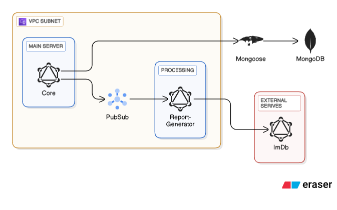
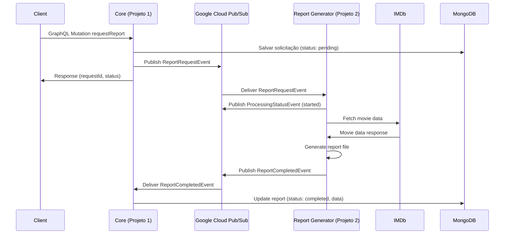
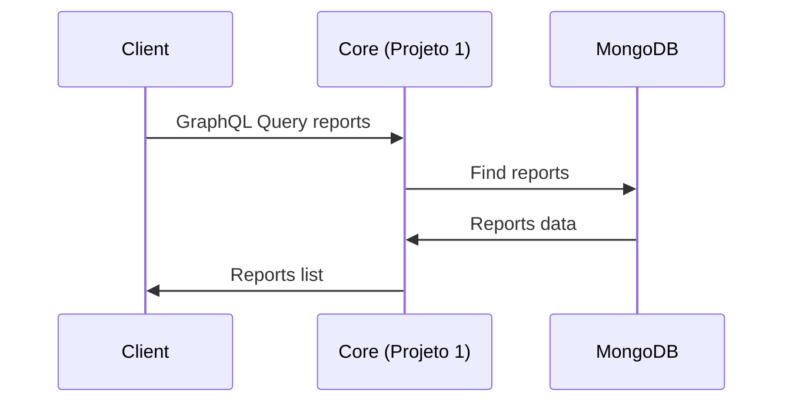

# Arquitetura do Sistema - GraphQL Microservice

Documentação da arquitetura do sistema de geração de relatórios com microserviços.

## 🏗️ Visão Geral da Arquitetura

Este projeto implementa uma **arquitetura de microserviços event-driven** usando **Google Cloud Pub/Sub** como backbone de comunicação. O sistema é composto por dois microserviços principais que se comunicam de forma assíncrona.



## 📦 Componentes do Sistema

### 🔵 Core (Projeto 1)
**Repositório independente** que implementa:
- API GraphQL para clientes externos
- Gerenciamento de autenticação e autorização
- Persistência de dados no MongoDB via Mongoose
- Publisher de eventos de solicitação de relatórios
- Subscriber de eventos de conclusão de relatórios

**Tecnologias:**
- Node.js + TypeScript
- Apollo Server (GraphQL)
- Mongoose (ODM MongoDB)
- Google Cloud Pub/Sub Client
- Express.js

### 🟢 Report Generator (Projeto 2)
**Repositório independente** que implementa:
- Processamento assíncrono de solicitações de relatórios
- Integração com APIs externas (IMDb)
- Geração de arquivos de relatórios (CSV/XLSX)
- Publisher de eventos de status e conclusão
- Subscriber de eventos de solicitação

**Tecnologias:**
- Node.js + TypeScript
- Google Cloud Pub/Sub Client
- Axios (HTTP Client)
- CSV-Writer / ExcelJS (Geração de arquivos)
- Node-Cache (Cache em memória)

### 🔄 Infraestrutura de Comunicação

#### Google Cloud Pub/Sub
Sistema central de mensageria que conecta os dois projetos:
- **Desacoplamento**: Os projetos não conhecem uns aos outros diretamente
- **Confiabilidade**: Entrega garantida de mensagens entre projetos
- **Escalabilidade**: Auto-scaling baseado na fila de mensagens
- **Durabilidade**: Persistência de mensagens até confirmação

#### MongoDB (usado pelo Core)
Banco de dados principal para:
- Dados de relatórios gerados
- Cache de dados de filmes do IMDb
- Metadados e configurações
- Logs de auditoria

## 🔄 Fluxo de Dados

### 1. Solicitação de Relatório


### 2. Consulta de Relatórios


## 📋 Eventos do Sistema

### Tipos de Eventos

#### 1. ReportRequestEvent
```typescript
interface ReportRequestEvent {
  id: string;
  type: 'movie-analysis' | 'trend-report' | 'user-stats';
  movieId?: string;
  userId?: string;
  parameters: Record<string, any>;
  requestedBy: string;
  timestamp: string;
}
```

#### 2. ProcessingStatusEvent
```typescript
interface ProcessingStatusEvent {
  requestId: string;
  status: 'started' | 'processing' | 'completed' | 'failed';
  progress?: number;
  message?: string;
  timestamp: string;
}
```

#### 3. ReportCompletedEvent
```typescript
interface ReportCompletedEvent {
  requestId: string;
  reportId: string;
  status: 'completed' | 'failed';
  fileUrl?: string;
  data?: any;
  error?: string;
  timestamp: string;
}
```

### Tópicos Pub/Sub

| Tópico | Subscriber | Finalidade |
|--------|------------|------------|
| `report-requests` | Report Generator | Solicitações de geração de relatórios |
| `report-completed` | Core | Notificação de relatórios concluídos |
| `processing-status` | Core | Status em tempo real do processamento |

## 🎯 Padrões Arquiteturais

### 1. Event-Driven Architecture
- **Comunicação assíncrona** entre microserviços
- **Desacoplamento temporal** - serviços não precisam estar online simultaneamente
- **Escalabilidade independente** de cada componente

### 2. CQRS (Command Query Responsibility Segregation)
- **Commands**: Mutations GraphQL que geram eventos
- **Queries**: Consultas diretas ao banco de dados
- **Separação clara** entre operações de leitura e escrita

### 3. Publisher-Subscriber Pattern
- **Publishers**: Core e Report Generator publicam eventos
- **Subscribers**: Cada serviço consome eventos relevantes
- **Loose coupling** entre componentes

### 4. Microservices Pattern
- **Single Responsibility**: Cada serviço tem uma responsabilidade clara
- **Independent Deployment**: Serviços podem ser deployados independentemente
- **Technology Diversity**: Cada serviço pode usar tecnologias otimizadas

## 🔧 Decisões de Design

### Por que Pub/Sub ao invés de HTTP?
1. **Resiliência**: Mensagens são persistidas até serem processadas
2. **Desacoplamento**: Serviços não precisam conhecer uns aos outros
3. **Escalabilidade**: Auto-scaling baseado no tamanho da fila
4. **Confiabilidade**: Entrega garantida com retry automático

### Por que MongoDB?
1. **Flexibilidade**: Schema flexível para diferentes tipos de relatórios
2. **Performance**: Consultas rápidas com índices apropriados
3. **Escalabilidade**: Suporte nativo a sharding
4. **Integração**: Excelente integração com Node.js via Mongoose

### Por que GraphQL?
1. **Flexibilidade**: Clientes podem solicitar exatamente os dados necessários
2. **Type Safety**: Schema strongly-typed
3. **Real-time**: Suporte nativo a subscriptions
4. **Developer Experience**: Ferramentas excelentes para desenvolvimento

## 📊 Estratégias de Cache

### 1. Cache de Dados IMDb
```typescript
// Cache em memória no Report Generator
const imdbCache = new NodeCache({
  stdTTL: 3600, // 1 hora
  maxKeys: 1000
});
```

### 2. Cache de Relatórios Frequentes
```typescript
// Cache no MongoDB com TTL
{
  movieId: "tt1234567",
  data: { ... },
  cachedAt: new Date(),
  expiresAt: new Date(Date.now() + 3600000) // 1 hora
}
```

## 🛡️ Considerações de Segurança

### 1. Autenticação
- **JWT Tokens** para autenticação de usuários
- **Service Account Keys** para comunicação entre serviços
- **Rate Limiting** na API GraphQL

### 2. Autorização
- **RBAC** (Role-Based Access Control) para diferentes tipos de usuários
- **Validação de dados** em todos os pontos de entrada
- **Sanitização** de parâmetros de entrada

### 3. Secrets Management
- **Google Secret Manager** para chaves de API
- **Environment Variables** para configurações não sensíveis
- **mTLS** para comunicação entre serviços (produção)

## 📈 Monitoramento e Observabilidade

### 1. Logs Estruturados
```json
{
  "timestamp": "2024-09-14T10:30:00Z",
  "level": "info",
  "service": "core",
  "requestId": "req-123",
  "operation": "requestReport",
  "duration": 150,
  "metadata": {
    "userId": "user-456",
    "reportType": "movie-analysis"
  }
}
```

### 2. Métricas
- **Request Rate**: Requisições por segundo
- **Error Rate**: Taxa de erro por operação
- **Latency**: Tempo de resposta (P50, P95, P99)
- **Queue Depth**: Tamanho das filas Pub/Sub

### 3. Distributed Tracing
- **Trace ID** propagado entre serviços
- **Span tracking** para operações críticas
- **Correlação** de logs entre microserviços

## 🚀 Estratégias de Deploy

### 1. Containerização
```dockerfile
# Multi-stage build para otimização
FROM node:18-alpine as builder
WORKDIR /app
COPY package*.json ./
RUN pnpm install
COPY . .
RUN pnpm build

FROM node:18-alpine
WORKDIR /app
COPY --from=builder /app/dist ./dist
COPY --from=builder /app/node_modules ./node_modules
CMD [\"node\", \"dist/index.js\"]
```

### 2. Orchestração
- **Docker Compose** para desenvolvimento local
- **Kubernetes** para produção
- **Cloud Run** para serverless deployment

### 3. CI/CD Pipeline
```yaml
# GitHub Actions example
name: Deploy Microservices
on:
  push:
    branches: [main]
jobs:
  test:
    runs-on: ubuntu-latest
    steps:
      - uses: actions/checkout@v2
      - run: pnpm test
  
  deploy-core:
    needs: test
    runs-on: ubuntu-latest
    steps:
      - run: docker build -t core ./core
      - run: gcloud run deploy core --image core
  
  deploy-report-generator:
    needs: test
    runs-on: ubuntu-latest
    steps:
      - run: docker build -t report-generator ./report-generator
      - run: gcloud run deploy report-generator --image report-generator
```

## ⚖️ Trade-offs da Arquitetura

### Vantagens
✅ **Escalabilidade independente** de cada microserviço  
✅ **Resiliência** - falhas isoladas não afetam todo o sistema  
✅ **Flexibilidade tecnológica** - cada serviço pode usar stack otimizada  
✅ **Desenvolvimento paralelo** - equipes podem trabalhar independentemente  
✅ **Testabilidade** - testes isolados por serviço  

### Desvantagens
❌ **Complexidade operacional** - mais componentes para gerenciar  
❌ **Latência de rede** - comunicação entre serviços adiciona overhead  
❌ **Eventual consistency** - dados podem estar temporariamente desatualizados  
❌ **Debugging complexo** - traces distribuídos são mais difíceis  
❌ **Overhead de infraestrutura** - mais recursos necessários  

## 🔮 Evolução da Arquitetura

### Fase 1 - MVP (Atual)
- 2 microserviços básicos
- Comunicação via Pub/Sub
- MongoDB single instance

### Fase 2 - Escalabilidade
- Adicionar cache distribuído (Redis)
- Implementar API Gateway
- Auto-scaling baseado em métricas

### Fase 3 - Alta Disponibilidade
- MongoDB replica set
- Multi-region deployment
- Circuit breakers e bulkheads

### Fase 4 - Otimização
- Event sourcing para auditoria
- CQRS com read models otimizados
- Machine learning para recomendações

---

Esta arquitetura foi projetada para ser **educativa** e demonstrar conceitos de microserviços, mantendo simplicidade suficiente para compreensão e experimentação.